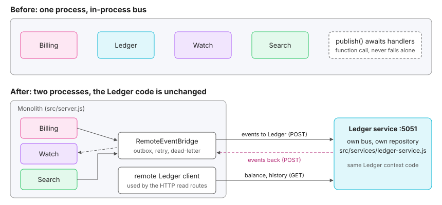

# SearchFly Architecture

SearchFly is a credit-based flight price tracker. A user creates a **watch** on a route, the system runs automated searches, Pricing detects a significant drop and Notification alerts the user. Each search run debits credits; credits are bought through a payment gateway and tracked by a ledger. When the credits run out, the user's watches are suspended automatically and reactivated as soon as the balance is restored.

The system is a **DDD monolith** (one deployable backend, 8 bounded contexts) with an **Expo React Native client**, kept in one Yarn-workspaces monorepo. This file describes the architecture **as it is today** and how to extend it. The history of the structure is in [REFACTORING_SUMMARY.md](../REFACTORING_SUMMARY.md); the Git workflow is in [GITHUB_SETUP.md](GITHUB_SETUP.md).

Last updated: October 2026.

---

## 1. System overview

```
┌──────────────────────────┐        REST + push (APNs / FCM)       ┌───────────────────────────────┐
│  apps/mobile             │ <──────────────────────────────────> │  apps/api                     │
│  Expo SDK 57, RN 0.86    │                                       │  Node.js monolith             │
│  Expo Router + Zustand   │                                       │  8 bounded contexts           │
│  client EventBus         │                                       │  in-process event bus (MVP)   │
└────────────┬─────────────┘                                       └───────────────┬───────────────┘
             │                                                                     │
             └────────────────────  packages/domain-events  ───────────────────────┘
                         shared DTOs + client-visible events (TypeScript contract)
```

| Part | Responsibility |
|------|----------------|
| `apps/api` | The monolith: domain model, use cases, event handlers. Private package `@searchfly/api`. |
| `apps/mobile` | The client. Runs against an in-memory mock server unless `EXPO_PUBLIC_API_URL` is set. Private package `@searchfly/mobile`. |
| `packages/domain-events` | The contract between server and client: DTOs and the events the UI must show. |
| `packages/ui` | Design tokens, shared components and the logomark. Declares `react`, `react-native`, `react-native-svg` as peer dependencies only. |
| `packages/config` | Shared `tsconfig.base.json` and prettier config. |
| `brand/` | Logomark SVGs. |
| `docs/` | This document, the experiment log, the Git setup notes, the architecture pages (HTML) and the wireframes. |

The visual architecture pages live next to this file: `SearchFly — Solution Architecture.html`, `SearchFly — Full-Stack Architecture.html`, `SearchFly — Frontend Architecture.html`, `SearchFly — P0 Credit Exhaustion & Reactivation Flow.html`, and the wireframes in `docs/WireFrames/`.

---

## 2. Bounded contexts

| Context | Owns | Backend today | Mobile today |
|---------|------|---------------|--------------|
| Watch Management | WatchRequest, lifecycle (`active`, `suspended_credits`, `expired`, `cancelled`) | `src/watch` (domain, use cases, handlers, in-memory repository and credit-status projection) | `modules/watch` |
| Billing | PaymentIntent, CreditPack, gateway interaction | `src/billing` (domain, use cases, in-memory repository) | `modules/billing` |
| Ledger | CreditLedger, LedgerEntry, the credit balance | `src/ledger` (domain, handlers, queries, in-memory repository) | `modules/ledger` |
| Scheduler | When each watch runs; pausing, resuming and ending the search window | `src/scheduler` (ScheduledSearch, run-due-searches use case, handlers, in-memory repository) | no module (schedule shown in the watch detail) |
| Search | SearchJob, PriceSnapshot, price history | `src/search` (domain, handler, price-history query, in-memory repository, FlightPort contract) | `modules/search` |
| Pricing | Price-drop and anomaly detection | not implemented | `modules/pricing` |
| Notification | Alerts, channel preferences, push delivery | not implemented | `modules/notification` |
| Integration | Providers (flight data, payment gateway adapters) | `src/integration` (deterministic fake flight provider; real providers later) | no module (admin/debug only) |

Every context has its own folder, events and value objects. They never import each other: a context only knows the payload of the events it subscribes to. `src/app.js` is the composition root that creates the event bus, wires the contexts and injects the flight provider.

### Context map (who reacts to whom)

```
Identity ── UserRegistered ────────────────> Ledger ── GiftCreditsGranted ──> Notification
Billing ── CreditsPurchased ──────────────> Ledger ── BalanceRestored ──> Watch Management ── WatchReactivated ──> Scheduler
Billing ── RefundRequested ───────────────> Ledger ── RefundAccepted ──> Billing ── CreditsRefunded ──> Notification
                                            Ledger ── RefundRejected ──> Billing ── RefundFailed ────> Notification / admin
                                            Ledger ── BalanceExhausted (if an accepted refund reaches zero)
Ledger  ── BalanceExhausted ──────────────> Watch Management ── WatchSuspendedDueToCredits ──> Scheduler (pauses)
Watch Management ── WatchCreated ─────────> Scheduler (first search runs immediately)
Watch Management ── WatchCancelled / WatchExpired ──> Scheduler (stops the schedule)
Scheduler ── SearchJobTriggered (jobId) ──> Search ── PriceSnapshotCaptured ──> Ledger ── SearchCreditDebited ──> audit log
                                            Search ── SearchJobFailed (no charge)
Scheduler ── SearchWindowEnded ───────────> Watch Management ── WatchExpired
Watch Management ── WatchSuspendedDueToCredits / WatchReactivated ──> Notification ──> push to the client
Search  ── PriceSnapshotCaptured ─────────> Pricing ── PriceDropDetected ──> Notification
Billing ── PaymentFailed ─────────────────> Notification
Ledger  ── GiftCreditsGranted ────────────> Notification
```

Watch Management is the owner of the watch lifecycle, so the Ledger's balance events go to it first and the Scheduler follows the watch events (before, the map showed Ledger → Scheduler directly). `jobId` is the idempotency key between Scheduler and Search. A refund is two-step: Billing only asks (`RefundRequested`) and the Ledger, the owner of the balance, accepts or rejects it, so a refund of credits already spent never marks the payment REFUNDED.

Billing, Ledger, Watch Management, Scheduler, Search and Integration exist in `apps/api`. Identity is a stand-in (`POST /api/users` publishes `UserRegistered`); Pricing and Notification are not implemented yet and are still simulated by the mobile mock server (Profile > Demo controls).

---

## 3. Layers inside a context

```
┌────────────────────────────────────┐
│ Presentation   controllers, routes │   thin; calls use cases
├────────────────────────────────────┤
│ Application    use cases, handlers │   orchestrates; no business rules
├────────────────────────────────────┤
│ Domain         aggregates, value   │   pure logic, no I/O, no framework
│                objects, events     │
├────────────────────────────────────┤
│ Infrastructure repositories,       │   technical concerns
│                gateways, adapters  │
└────────────────────────────────────┘
```

- **Domain:** aggregates enforce invariants and record domain events (`pullDomainEvents()` hands them to the caller); value objects are immutable (frozen) and compared by value; events are frozen facts created by factories (`makeEvent`: `eventId`, `occurredAt`, `type`, payload).
- **Application:** use cases (for example `ConfirmPaymentUseCase`) load and save aggregates through repositories and publish the events the aggregate recorded. Event handlers (`OnCreditsPurchased`, `OnPriceSnapshotCaptured`, `OnRefundRequested`) are thin subscribers that delegate to an aggregate.
- **Infrastructure:** repositories (`findByUserId`, `save`), payment gateway adapters, the event bus implementation. Gateway vocabulary is translated here, so the domain never sees gateway language.
- **Presentation:** an Express 5 app in `src/http` (routes call use cases and queries only; one error handler maps `DomainError` subclasses to HTTP status codes). It sits next to the contexts, not inside them.

### Backend layout today

```
apps/api/src/
  app.js                       composition root: event bus, contexts, flight provider, clock
  server.js                    startServer(): HTTP listener + scheduler timer (SCHEDULER_TICK_MS)
  shared/                      technical kernel only (no domain concepts)
    domain-event.js            makeEvent(type, payload)
    in-process-event-bus.js    subscribe(type, handler) / publish(event)
    errors.js                  DomainError, ValidationError 400, ForbiddenError 403, NotFoundError 404, ConflictError 409
  billing/                     PaymentIntent, CreditPack; use cases: InitiatePayment, ConfirmPayment, RefundPayment,
                               ListUserPayments, ListCreditPacks
  ledger/                      CreditLedger, LedgerEntry; handlers (UserRegistered, CreditsPurchased,
                               PriceSnapshotCaptured, RefundRequested); queries (GetCreditBalance, GetLedgerHistory)
  watch/                       WatchRequest; use cases (CreateWatch, CancelWatch, GetWatch, ListUserWatches);
                               handlers (OnBalanceExhausted, OnBalanceRestored, OnSearchWindowEnded);
                               infrastructure: watch repository, credit-status projection fed only by events
  scheduler/                   ScheduledSearch; RunDueSearchesUseCase; handlers follow the watch events
  search/                      SearchJob, PriceSnapshot; OnSearchJobTriggered (idempotent by jobId);
                               GetPriceHistory; application/flight-port.js (the contract Integration implements)
  integration/                 fake-flight-provider.js (deterministic, seedable, failNext / noOffersFor)
  http/                        create-http-app.js, middleware.js, routes/{users,credits,payments,watches,dev}.js
    (each context folder has index.js, domain/, application/, infrastructure/)
```

The in-memory repositories store a snapshot and rebuild a fresh aggregate on every read, like a real database would, so tests catch a forgotten `save()`. Replace them with database repositories (same `findBy...` / `save` methods) when persistence is added. Ledger entries for purchases and refunds are idempotent (one entry per payment), because an event bus can redeliver events.

### REST API (Express 5)

Authentication is temporary: send the user id in the `x-user-id` header (there is no Identity context yet). Errors always have the shape `{ error: { code, message } }`.

| Method and path | Purpose | Auth |
|-----------------|---------|------|
| `GET /health` | liveness | no |
| `POST /api/users` | register a user (publishes `UserRegistered`, gift credits) | no |
| `POST /api/payments/webhook` | gateway result (signature verification is a TODO) | no |
| `GET /api/credits` | credit balance (Ledger) | yes |
| `GET /api/credits/history` | ledger entries | yes |
| `GET /api/credit-packs` | credit packs for sale | yes |
| `POST /api/payments` | create a checkout for a pack (201) | yes |
| `GET /api/payments` | list the user's payments | yes |
| `POST /api/watches` | create a watch (201) | yes |
| `GET /api/watches` | list the user's watches | yes |
| `GET /api/watches/:id` | one watch (404 if it belongs to someone else) | yes |
| `DELETE /api/watches/:id` | cancel a watch | yes |
| `GET /api/watches/:id/price-history` | snapshots, lowest and latest price | yes |
| `POST /api/dev/scheduler/tick` | run the due searches now (only with `ENABLE_DEV_ROUTES=true`) | yes |

The refund use case is not exposed over HTTP on purpose; it will be an admin action. In production the scheduler runs on a timer inside `server.js` (`SCHEDULER_TICK_MS`, default 60000, `0` disables it).

---

## 4. Communication rules

1. **Contexts talk only through domain events.** A context never requires another context's aggregates, value objects, repositories or stores.
2. **No shared value objects between contexts.** Each context redefines what it needs in its own language (Billing's `PaymentAmountVO` mirrors Search's `MoneyVO`).
3. **Events are facts in the past tense** (`CreditsPurchased`, not `AddCredits`), immutable, and carry the identifiers subscribers need.
4. **The Ledger is the only source of the credit balance.** The UI never derives it from Billing data.
5. **Handlers are idempotent where possible** and written against an event bus interface (`publish(event)`) so the in-process bus can be replaced by a message queue later.
6. **Server-internal events stay in the monolith.** Only the events the UI must show are part of the shared contract in `packages/domain-events` (`WatchSuspendedDueToCredits`, `WatchReactivated`, `BalanceRestored`, `CreditsPurchased`, `PriceDropDetected`, `AlertReceived`).

```javascript
// OK: inside one context
const { CreditLedger } = require('../domain/aggregates');   // inside src/ledger

// OK: across contexts, only by reacting to an event payload
bus.subscribe('CreditsPurchased', (event) => handler.handle(event));

// NOT OK: reaching into another context
const { PaymentIntent } = require('../../billing/domain/aggregates');   // from src/ledger or src/search
```

### 4.1 The Ledger as a separate process

The Ledger can leave the monolith without changing any other context. `createApp({ ledgerUrl })` swaps the local Ledger for a `RemoteEventBridge` (events, at-least-once, retry, dead-letter, de-duplication by `eventId`) and a remote client (`src/ledger/client.js`) for the balance and history queries. `src/services/ledger-service.js` is a second composition root that hosts the same Ledger code with its own bus and repository.



What changes across the network (consistency, duplicates, outages, 503 on reads) is catalogued with tests in [EXPERIMENT_REFACTORING.md](EXPERIMENT_REFACTORING.md). The dependency rule above is enforced by `tests/unit/architecture/dependency-rule.test.js`.

---

## 5. Client architecture (`apps/mobile`)

- **Expo Router** routes live in `app/` and are **composition points only**: they fill screen slots with components from the modules.
- **One folder per bounded context** in `src/modules/` (`watch`, `billing`, `ledger`, `notification`, `search`, `pricing`), each with its own Zustand `store.ts`, `events.ts` and components/screens. A module **never imports another module's store**.
- **Client EventBus** (`src/shared/bus`) mirrors the server's event emitter. Cross-module data flows through it; for example `WatchSuspendedDueToCredits` updates the watch store (`suspended_credits`) and the notification store.
- **API layer** (`src/shared/api`): `http.ts` for the real backend, `mock/` for the in-memory server. `USE_MOCK` is true when `EXPO_PUBLIC_API_URL` is empty.
- **Push channel** (`src/shared/push`): in mock mode the mock server pushes straight into the bus; in real mode it uses `expo-notifications`, loaded lazily and skipped inside Expo Go (Android remote push was removed from Expo Go in SDK 53).
- **Rules:** suspended watches always show the top-up call to action; the Ledger store is the only balance source; alert preferences are a separate screen, not part of the watch form; Scheduler and Integration have no mobile module.

Details and the Expo upgrade procedure are in [apps/mobile/README.md](../apps/mobile/README.md).

---

## 6. Testing strategy

Backend tests run with **Jest** (`apps/api/jest.config.js`). The configuration defines three isolated Jest "projects", selected with `--selectProjects`:

| Project | Purpose | Needs |
|---------|---------|-------|
| `unit` | Domain logic (aggregates, value objects, events) in milliseconds, written test-first (TDD). | nothing |
| `integration` | Use cases and handlers wired together with in-memory repositories and an in-process bus. | a global setup file |
| `stage` | End-to-end behavior against a running server, a database and mocked providers; longer timeout. | global setup and teardown |

Unit tests live in `tests/unit/{billing,ledger,watch,scheduler,search,integration,shared}` (aggregates, value objects, use cases, handlers, queries, repositories, fake provider, event bus). Integration tests: `billing-ledger.flow.test.js` (Billing + Ledger), `search-orchestrator.flow.test.js` (the P0 flow across Watch, Scheduler, Search, Ledger and Billing with a fake clock), `http-api.test.js` (HTTP contract with supertest) and `server.test.js` (real port and scheduler timer). Together they cover about 98% of statements. The `stage` project has placeholder setup files (`tests/stage/setup.js`, `tests/stage/teardown.js`) that do nothing yet; fill them in when the first end-to-end test is written. `npm test` runs the unit and integration projects. Coverage thresholds are 80% branches and 85% functions and lines (`npm run test:coverage`). The mobile app has no automated tests yet; its checks are `yarn typecheck` and `npx expo-doctor`.

---

## 7. Build and run

```bash
yarn install                        # repo root
yarn mobile                         # Expo dev server (mock backend by default)
yarn typecheck                      # type-checks the mobile app
yarn api:test                       # backend tests
yarn api:coverage                   # backend tests with coverage thresholds
yarn api:start                      # REST API on port 5050 (ENABLE_DEV_ROUTES=true adds the dev tick route)
yarn api:ledger                     # the Ledger as its own service (see section 4.1)
yarn api:footprint <repo> <base> <head> <ledger|billing>   # change-footprint metric
docker build -t searchfly-api apps/api
node apps/api/examples/billing-example.js              # Billing + Ledger lifecycle
node apps/api/examples/p0-credit-exhaustion-example.js  # P0 flow across the real contexts with a fake flight provider
```

`apps/api` keeps its own `package-lock.json` because the Docker build context is `apps/api` and the image installs with `npm install`.

---

## 8. Extending the project

### Add a bounded context (backend)

1. Create `apps/api/src/<context>/{domain,application,infrastructure,presentation}`.
2. Model aggregates and value objects in `domain`; record events in the aggregate's behavior methods.
3. Add use cases and event handlers in `application`.
4. Subscribe to other contexts' events through the event bus; never import their code.
5. Write the unit test first (`tests/unit/<context>/...`), then the code.
6. If the UI must show an event, add it to `packages/domain-events/src/events.ts` and handle it in the matching mobile module.

### Add an aggregate or a repository

1. Add the aggregate to `domain/aggregates.js` (or its own file once the file grows) and export it.
2. Define the repository contract the use cases need (`findBy...`, `save`) and implement it in `infrastructure/persistence`.
3. Keep persistence details out of the domain.

### Add a mobile module

1. Create `apps/mobile/src/modules/<context>/` with `store.ts` and `events.ts`.
2. Subscribe to the client bus in `events.ts`; export components and screens.
3. Compose them from a route in `app/`; do not import other modules' stores.

---

## 9. Known gaps

- Repositories are in-memory only; there is no database. Persistence behind the repository interface (for example SQLite) is future work.
- The remote bridge keeps its outbox and its processed-event set in memory. Production needs a transactional outbox and persistent de-duplication (see EXPERIMENT_REFACTORING.md, leaks 3 and 5).
- Authentication is a temporary `x-user-id` header; there is no real gateway adapter (the payment webhook is simulated).
- Pricing, Notification and the real flight provider are not implemented (the Integration context ships only `FakeFlightProvider`).
- Real push notifications need a development build; Expo Go runs the mock flow only.
